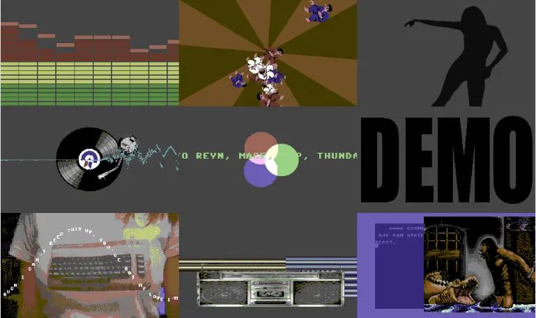

In november 2013, a small, quite obscure demoscene gathering called '1991' took
place in Scheveningen/Holland. My friend [John](https://www.johnbruin.net/)
wanted to release a HTML5 demo in 1991 style there, and asked me to contribute
some parts to that. So here it is:

[Start the demo](https://johnbruin.net/1991demo/index.htm)

The bottom three parts in this overview screenshot are made by me.
The one on the bottom left is a small tribute to [Bas Bron](https://en.wikipedia.org/wiki/Bas_Bron)'s video clip to [You've got my love](https://www.youtube.com/watch?v=-LsDy7N-Nz4). Bas was also at the party, performing an excellent DJ set of Commodore 64 tunes, which you can see below.


