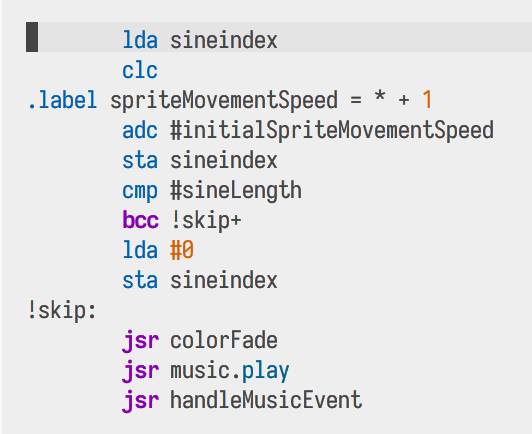
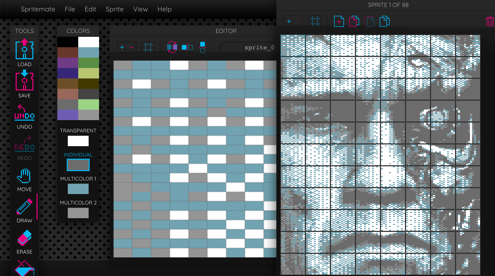
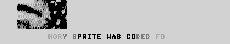
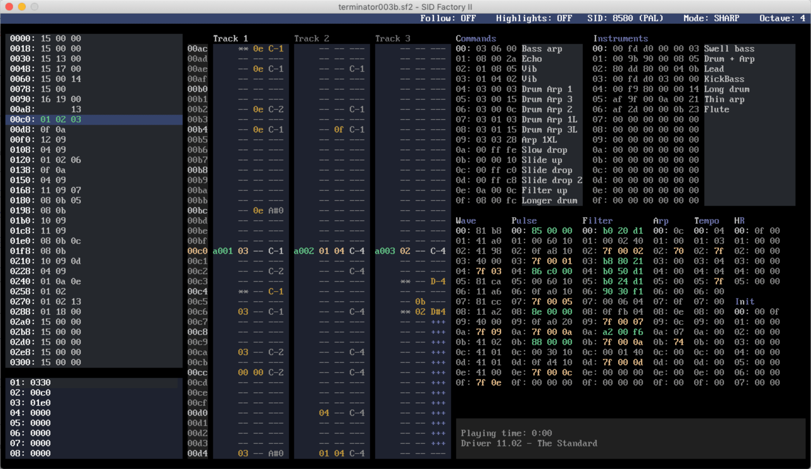

After 30 years of coding anything for the [Commodore
64](https://en.wikipedia.org/wiki/Commodore_64), I have released a small demo.
Back in the 80s I started to teach myself programming on this machine, and I
though it would be fun to revisit my coding roots.

The [demoscene](https://en.wikipedia.org/wiki/Demoscene) of the Commodore 64 is
still very much alive, and seeing the amazing stuff that is coming out nowadays,
I was motivated to try and add a little something to that.

At the same time, there was a [Sprites only
competition](https://csdb.dk/event/?id=3003) going on at
[CSDB](https://csdb.dk/event/?id=3003), so that gave me some direction on what I
could code. I also just added a sprite mode to my
[retropixels](/posts/retropixels-0-8-0) tool, so I decided to make a big angry sprite.

Links: [Download Commodore 64 binaries](https://csdb.dk/release/?id=199156),
[watch it in an online emulator](/big_angry_sprite),
[view the source
code](https://github.com/micheldebree/big_angry_sprite) or [listen to the
music](https://deepsid.chordian.net/?file=/SID%20Happens/Terminator.sid)



## Assembler coding is fun

To get the kind of performance that is needed for realtime visual effect code,
you have to use assembler code. This is the code that translates 1 on 1 to the
instructions that the [MOS 6510
CPU](https://en.wikipedia.org/wiki/MOS_Technology_6510) can execute. An
assembler adds some preprocessing tools like macro's and labels, but the actual
code is written in basic opcodes like `lda`, `sta`, `inc`, `bpl` etc. Have a
look at the [source
code](https://github.com/micheldebree/big_angry_sprite/blob/main/big_angry_sprite.asm)
to see what that looks like.

I found it very cool to be coding so close to the
metal again. In my daily work I am so many abstraction layers away from the
actual hardware, this was a very refreshing (and nostalgic) experience.

## Display hacking

A good Commodore 64 demo should be both pleasing to the eyes and ears, and
display some clever hacking to achieve stuff that is not normally possible on
the old breadbox.

This demo has neither.

Just kidding. There is some display hacking involved. First of all the
competition rules allow only the use of "sprites": 24 x 21 pixel graphics that
can be positioned anywhere on the screen, and of which you have 8 at your
disposal. This demo uses 102 sprites.

### Racing the beam to display more sprites

8 sprites is not much to work with, and as you can see there is a big angry face
on screen, and a scrolltext, which doesn't all fit in 8 blocks of 24 x 21
pixels. This is done with a trick called sprite multiplexing. And it works like
this:

50 times a second, the Commodore 64's screen is drawn by the graphics chip
(VIC), left to right, top to bottom. The invisible pencil drawing the screen is
called the raster beam. You have no control over this, but you _can_ know at
which vertical position the raster beam is at any given time.

The trick to multiplexing is waiting until the raster beam has just finished
drawing a sprite, then move the sprite somewhere under the raster beam, where
the beam will encounter it again and draw it again. After the second instance of
the same sprite has been drawn again, you move it back to its first position for
the next round of screen-drawing. If you also switch the pointer which points to
the actual graphics data for the sprite, they will look like two totally
different sprites.

With this clever trick you are now only limited to 8 sprites on a horizontal
line, but a lot more in the vertical direction. At the cost of having to
constantly move the sprites around at the right time of course. The big angry
face is in fact made up of 11 rows of 8 sprites. It needs precise timing in the
multiplexer because the sprites are touching, which leaves little time to put a
row of sprites that has finished drawing into their new position.

### Removing the upper and lower border

The Commodore 64 screen has a border around it, to make up for different TV and
monitor sizes in the 80s. Nothing can happen in it (except change its color).
Unless you make use of another trick to make them disappear.

This is racing the beam again. There is one thing you can do to the border
beside change its color, and that is making it 8 pixels bigger in all
directions, overlapping the screen. This feature is handy to mask artifacts that
occur at the edges when scrolling graphics in games.

The trick is this; when the raster beam is almost at the lower border, switch to
the bigger border setting. The lower border is now 8 pixels higher, and the edge
is _behind_ the raster beam. So the raster beam missed the border edge. The VIC
chip now thinks it has already started drawing the border earlier and doesn't
switch to border-mode. The result is that the upper and lower borders are not
drawn.

The only thing that can exist in the border we just made to disappear is
sprites. Perfect for an "Only sprites" compo!

In this demo, some of the big angry face is in the upper and lower borders, and
the scroller at the bottom is completely in the lower border.

_P.S._ the left and right borders can be removed in a similar way but it requires
code with cycle-exact timing on _every_ horizontal line where you don't want the
border. This is a pain to get right and costs a lot of cpu cycles, so I decided
to leave that for next time.

### Faking more than 8 sprites in a row

The scroller in the lower border is the full width of the screen: 40 characters,
which makes 40 x 8 = 320 pixels. We can only display 8 sprites on a horizontal
line, giving us 8 x 24 = 192 pixels. Not enough. The trick here is in the color
fade effect that scrolls through the text a at quicker speed, leaving some parts
of the text completely blank. 

In fact, only 8 sprites are visible at a time,
but their location rapidly changes to cover the whole 320 pixel area. There are
14 flickery sprites in the scroller.

## Syncing to the music

The music is a cover of the theme music of [The
Terminator](https://www.rottentomatoes.com/m/terminator). I made it with the
excellent [SIDFactory II](https://blog.chordian.net/sf2).

As I am also doing
some development on that project, I was able to use an adapted version of the
music routine that can emit events incorporated in the tune. By reacting to
these events in the main code, the flashing and the changes of movement were
timed to the music.

## Cross platform development

Whereas the last time I coded something for Commodore 64, I was doing it
on the machine itself, this time there was no physical C64 in sight. All coding
and testing was done on my laptop with the help of these excellent tools:

- [Kickassembler](http://www.theweb.dk/KickAssembler) compiles assembler
  sources to machine code
- [Vice](https://vice-emu.sourceforge.io) is the _de facto_ standard Commodore
  64 emulator
- [C64Debugger](https://sourceforge.net/projects/c64-debugger/): With Vice at
  the core, adds a lot of debugging options and is ideal for stepping through
  the code while keeping an eye on the raster beam.
- [Visual Studio Code](https://code.visualstudio.com) with Paul Hocker's [Kick
  Assembler for Visual Studio
  Code](https://gitlab.com/retro-coder/commodore/kick-assembler-vscode-ext)
  basicly turns Visual Studio Code into a Kickassembler IDE.
- [Retropixels](/posts/retropixels-0-8-0) converts an image to Commodore
  64 format (sprites in this case.)
- [Spritemate](https://www.spritemate.com) is an online sprite editor that I used
  to touch up the sprites a bit.
- [SIDFactory II](https://blog.chordian.net/sf2) is a cross platform editor for
  [SID](https://en.wikipedia.org/wiki/MOS_Technology_6581) tunes.
- [Exomizer](https://bitbucket.org/magli143/exomizer/wiki/Home) compresses a
  Commodore 64 program to save disk space and loading time.
