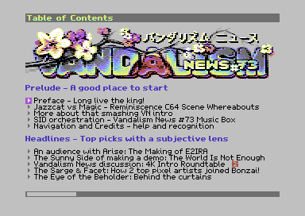

After having made a tune for Vandalism News #72 ([Sunkissed](/posts/sunkissed)),
this time I (in The Netherlands) cooperated on a tune with Thomas Egeskov
Petersen a.k.a.  [Laxity](https://csdb.dk/scener/?id=677) (in Denmark) and Sanke
Michael Choe a.k.a.  [SMC](https://csdb.dk/scener/?id=1283) (in Sweden) for
[Vandalism News #73](https://csdb.dk/release/?id=225729).



Even though my contribution is pretty minimal, it was good fun working with
these guys because I am a big fan of their music, and they are very cool guys on
top of that! 

Vandalism News is a digital magazine about the Commodore 64 Demoscene, which
runs on the Commodore 64. It contains a jukebox of tunes to listen to while
reading.

