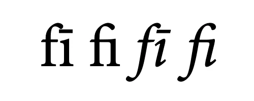
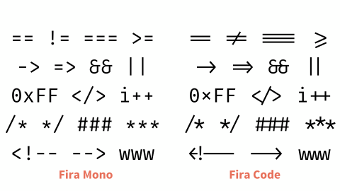
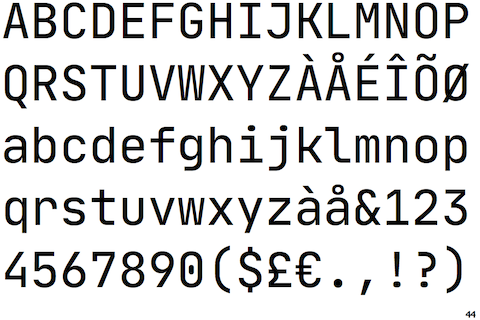
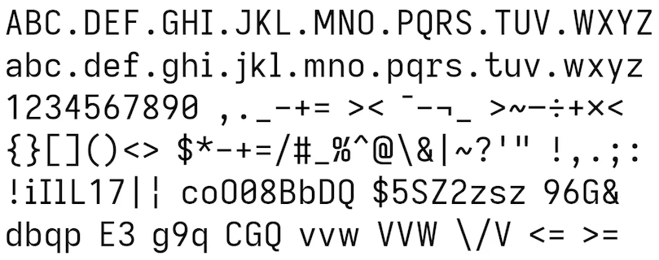

As a coder (both professionally and for fun), I spend a lot of time looking at
monospaced text on a computer screen. Using a good font is important to me
because it helps in concentration and reduces fatigue. I tried different fonts,
and settled on [Jetbrains Mono](https://www.jetbrains.com/lp/mono/) for my IDE
and text editor, and [Iosevka](https://typeof.net/Iosevka/) for the terminal.

## What makes a good font?

### A unique character

A good font for coding should have clear distinctions between characters, for
example it should be clear that a `0` is not an `O`, and which is the zero and
which the capital O. Another example is `1` and `l`. This is important because
in code, it is not always clear from the context if something is a number or a
letter, and computers are very picky. If you ever typed in a long WiFi password
a couple of times before realizing that zero was actually a capital O, you know
what I mean.

### All widths are equal

Coding fonts need to be monospaced, meaning that all the characters are equal
width. This helps because in code, every character is equally important to get
right, and it also helps a lot in lining up lines of code vertically to keep it
legible.

### The power of invisibility

When coding I need focus
and concentration. If a font has even a few quirks in legibility or feels
unbalanced, it distracts me from what I am doing.

That's what I mean by invisible; I need to be able to look _through_ the font,
only at the information that it conveys. It's a bit like looking through a clear
window, and suddenly your eye re-focusses on a little smudge on the glass. You
lose your train of thought and are suddenly focussed on removing that irritating
spot.

### Ligatures are good/bad

Ligatures are multiple characters combined into one. A well known example from
printing is that the character f and i are combined into one fi character, like
the example below:



> Examples of a ligature; two characters melted into one

For coding, a font can support ligatures for stuff like arrows etc, as seen
below in the popular [Fira](https://mozilla.github.io/Fira/) font.



> Fira without ligatures (left) and with ligatures (right)

Ligatures are controversial among coders; they hide the exact characters you
typed behind another representation, which doesn't sit well with some coders. I
understand that, but I do use them because to me, it does make the code look
more elegant and readable.

Not all fonts support ligatures. If the font you like does not support it, you
can go over to [nerdfonts.com](https://www.nerdfonts.com) and see if they have a
patched version of your favorite font with the ligatures added to it.

## Selecting a font

When you use a text editor or IDE for coding, it is usually pre-configured with
a monospaced font, so you're good to go. But if you think things could be
better, a good place to try is
[programmingfonts.org](https://www.programmingfonts.org/). You can try out more
than 100 programming fonts in your browser and see which one you like best.

## My choice: Jetbrains Mono and Iosevka

After trying different options (not considering the payed options by the way), I
settled on [Jetbrains Mono](https://www.jetbrains.com/lp/mono/). Before
Jetbrains released this font, I was using [Source Code
Pro](https://adobe-fonts.github.io/source-code-pro) by Adobe, which is also
fine.



> Jetbrains mono

I also came across [Iosevka](https://typeof.net/Iosevka/), which I find a little
too narrow for coding. But it is perfect for use in my terminal, where I want to
cram in as much text as I can. I really like the legibility and balance of this
font.



> Iosevka

If you are using [Homebrew](https://brew.sh/) on macOS, like I am, you can
install both these fonts with:

```sh
brew install font-jetbrains-mono font-iosevka
```
