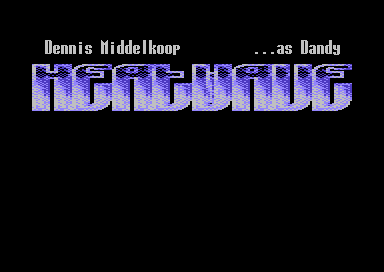
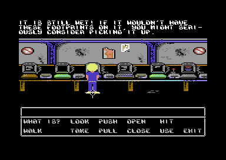
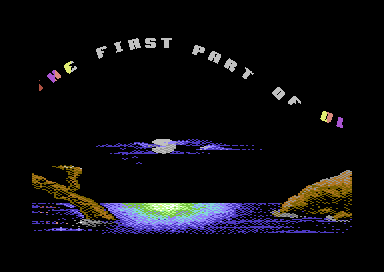
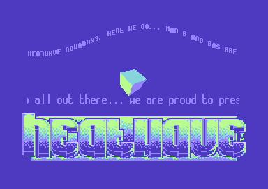
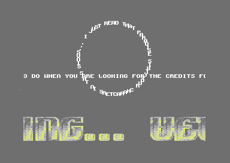
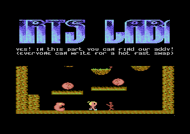
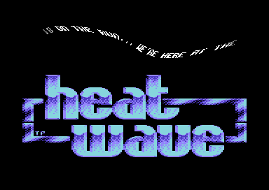
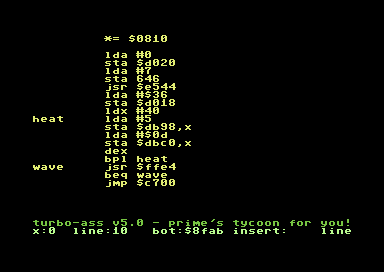
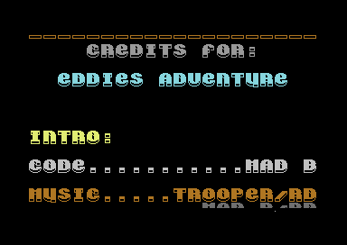

1991 marked the end of the Commodore 64 era of out little democoding group
"Heatwave". We didn't know it at the time but we must have felt we wanted to go
out with a bang, and make a megademo in which we made everything ourselves.

It was quite common practice to 'borrow' resources like music and fonts from
other demos or games. We didn't want to do any of that this time. So all the
code, music and graphics came from our own hands.

At the time we were really impressed by the demos of
[Crest](https://csdb.dk/group/?id=238). We were particularly inspired by their
demos that had a theme and a menu, like [McDonald's
Restaurant](https://csdb.dk/release/?id=3097). So we came up with a theme of our
own: Eddie is at a demoparty for the first time and can look around, LucasArts
point-and-click adventure style. Then, when he looks at one of the screens, he
sees a demo part.

This was really Bas' demo; he coded all of the main parts. I (under my handle
Mad B) did the intro and the menu, and some of the music.

It was released at the [Silicon Limited Summer
Party](https://csdb.dk/event/?id=34) in 1991, where it came 6th in the demo
competition. You can download it [here](https://csdb.dk/release/?id=4718).

## Intro and menu

> "Intro", a logo stretcher and a simple scrolltext.
> By Mad B (code and
> [music](https://deepsid.chordian.net/?file=/MUSICIANS/H/HeatWave/youtH/EA-Intro_1.sid)), Trooper ([music](https://deepsid.chordian.net/?file=/MUSICIANS/H/HeatWave/Yavin/EA-Intro_2.sid)) and Dandy (gfx).

> "Menu", A LucasArts style click-and-point adventure giving access to the
> different parts of the demo.
> By Mad B (code), Dandy (gfx) and Trooper
> ([music](https://deepsid.chordian.net/?file=/MUSICIANS/H/HeatWave/Yavin/EA-Eddie_at_the_Party.sid)).

## The monitors

On each of the TV's or monitors at the party place, a demo part is running. If
you "look at" it, it shows you the part up close. When you press the spacebar, you end
up at the party place again.

> "Mega DXYPPer", A wavy scroller with rotating letters.
> By Bas (code), Dandy (gfx), Trooper (gfx) and Mad B
> ([music](https://deepsid.chordian.net/?file=/MUSICIANS/H/HeatWave/youtH/EA-Azure_Landscape.sid)).

> "Amiga filled vectors", A wavy scrolltext with more than 40 characters, and
> a rotating cube in full hires.
> By Bas (code), Trooper
> ([music](https://deepsid.chordian.net/?file=/MUSICIANS/H/HeatWave/Yavin/Mixed_Up.sid) and gfx) and Dandy (gfx).

> "Circle DXYCPer", A scrolltext moving in a circle, with a regular scroller
> moving over it.
> By Bas (code), Mad B
> ([music](https://deepsid.chordian.net/?file=/MUSICIANS/H/HeatWave/youtH/EA-Circle_DXYCPer.sid)) and Dandy (gfx).

> "The Whuppie Tale", A little upscrolling game.
> By Bas (code and gfx) and Mad B
> ([music](https://deepsid.chordian.net/?file=/MUSICIANS/H/HeatWave/youtH/EA-Little_Game.sid)).

> "Tech-tech DYPPer", a wavy scrolltext waving up and down, and left and right
> at pixel precision.
> By Bas (code), Trooper
> ([music](https://deepsid.chordian.net/?file=/MUSICIANS/H/HeatWave/EA-Tech-Tech_DYPPer.sid) and gfx), Mad B([music](https://deepsid.chordian.net/?file=/MUSICIANS/H/HeatWave/EA-Tech-Tech_DYPPer.sid)) and Dandy (gfx).

> "Turbo Assembler", showing the screen of somebody that is coding
> assembler on the c64. The whole demo was coded like this.
> By Mad B (code).

> "Finishing Touch", upscrolling credits.
> By Bas (code) and Trooper
> ([music](https://deepsid.chordian.net/?file=/MUSICIANS/H/HeatWave/Yavin/EA-Credits.sid) and gfx)

## Easter egg part

This part is not behind any of the monitors, but happens when you pick up the
floppy disk from the floor.

> "Commercial Break", a hidden part announcing a new edition of our disk
> magazine "Total Recall".
> By Bas (code) and Trooper
> ([music](https://deepsid.chordian.net/?file=/MUSICIANS/H/HeatWave/Yavin/EA-Commercial_Break.sid) and gfx)
