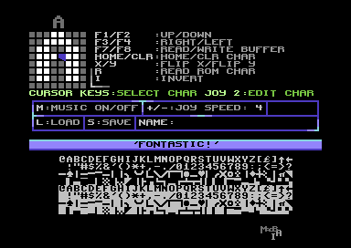
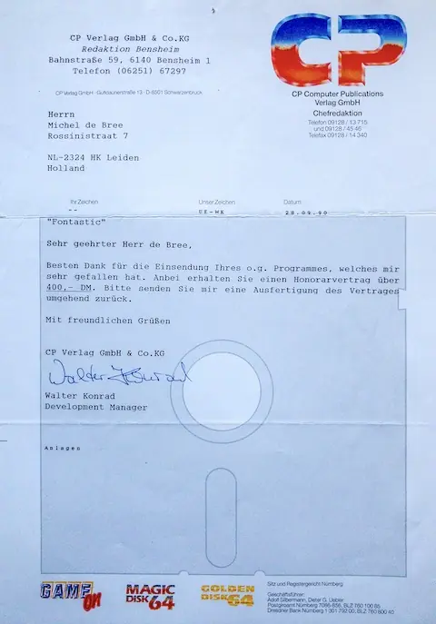
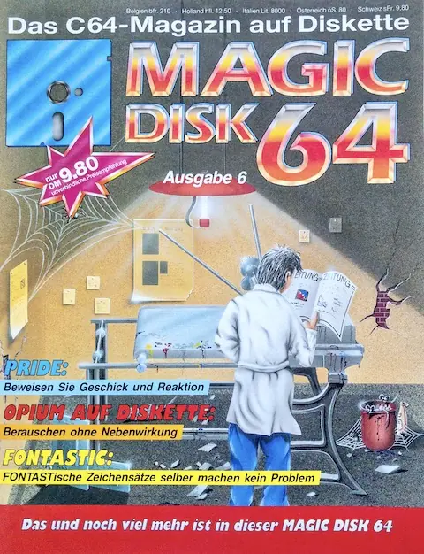

After the thrill of making money from coding with [Solitair](/posts/solitair),
I thought I'd try again and made a utility for drawing your own fonts on the
Commodore 64, called Fontastic.

I sent it off to "Magic Disk 64" again, and got a letter back saying they liked
it and were willing to pay for it:

And sure enough, a few months later I saw the magazine with my tool on it in the
shop:

