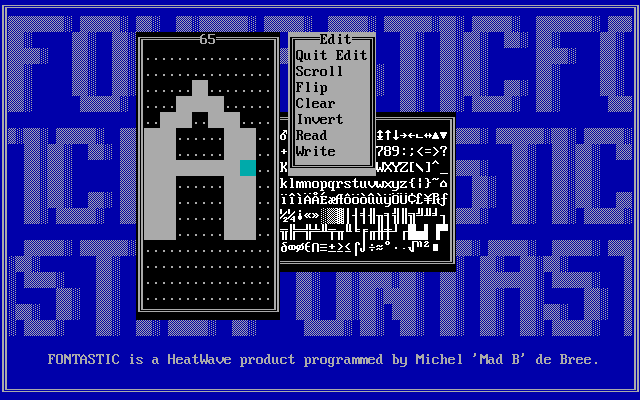

I had sort of forgotten about this until I found it on an old CD-ROM. A utility
to create an alternative font for the EGA or VGA textmode.

At the time I was using Pascal for the code, because I had some experience with
it and I liked the ease with which it could mix Pascal and assembler code.

Check it out on [Github](https://github.com/micheldebree/fontastic)
