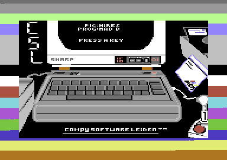
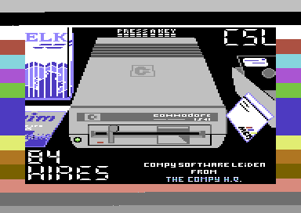
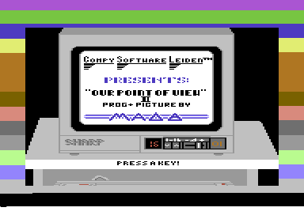
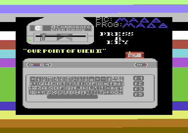
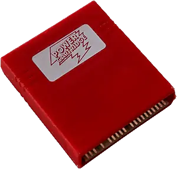
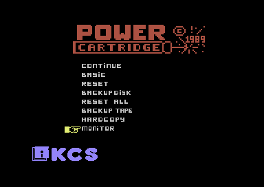
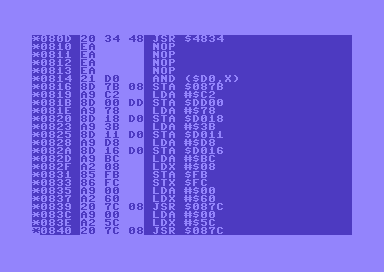

One of my first ventures in demo coding (see
[Demoscene](https://en.wikipedia.org/wiki/Demoscene)) was a very simple picture
collection with background music. The pictures were made by my cousin "Hires",
and by myself, "Mad B". I had just figured out how to display a multicolor
picture, and how to play a soundmonitor tune.

## Our point of view

[Available on CSDB](https://csdb.dk/release/?id=223777)

## Our point of view 2

[Availale on CSDB](https://csdb.dk/release/?id=223780)

## The making of

### Our fascination with the demoscene

Both Hires and me had a Commodore 64 and were fascinated with demo's; programs
that showed off coding, drawing and music skills and were pushing the limits of
what the Commodore 64 could do. They originated from the intro's that software
crackers put in front of the pirated games that we were playing.

Because of this background, the makers of these demo's hid behind handles (much
like in the graffiti scene), adding a certain mystique to the demoscene. They
organized in groups with names like '1001 crew', 'The Judges' and 'Rawhead',
groups that acknowledged and greeted each other in scrolling text messages, or
were dissing each other because they thought others were 'lamers'.

We got all this information from the demo's on the floppy disks that were
swapped by snailmail with people from all over Europe; there was no internet and
we didn't have a clue who these people were or what they looked like. All we
knew is that they were about our age, cool, talented, and that we wanted to be
like them.

Hires and his friend and neighbour "Herion" had already organized in the group
"Compy Software Leiden", and I joined them soon after as "Mad B".

### The secret language of the machine

I had been programming in BASIC, but it was apparent that this language was too
slow to achieve what we saw in demo's. We needed to get closer to the actual
machine and learn 'machine code'; the instructions that the hardware itself
understands. BASIC was programmer friendly, but machine code reads much more
obscure to the human eye. What's more, unlike BASIC, which was built into the
machine, the Commodore 64 has no built in functionality to help you program in
machine code.

But, the [KCS Power Cartridge](https://retro.ramonddevrede.nl/kcs-power-cartridge/) had!

### The KCS power cartridge

> The KCS Power Cartridge. Press a little white button in the back to enter
> the power menu

This cartridge plugs in to the cartridge port and extends the Commodore 64 with
some powerful tooling. To us, the most important tool was called the 'monitor'.
This was our magical doorway into the world of machine code. With this tool we
could:

- Freeze a running demo
- See the machine code, displayed as more readable mnemonics like `LDA`, `STA`,
  `INX` etc.
- See data bytes like scroll texts displayed as readble characters
- Change machine code and data
- Continue running the demo and see your changes
- Save it to disk

> The KCS Power Cartridge monitor unveiling the secrets of machine language

In the image above, you see the memory location on the left (there are `$ffff`
of them, so about 64k). Next to that you see the bytes that the CPU understands
as instructions. Each instruction is one byte, optionally followed by one or two
bytes as an argument to the instructions. The third column shows the instruction
as mnemonics (also called assembler code), making it a bit more readable.

So, after studying existing demo's, changing their appearance and scrolltexts to
claim that we made them (ahem...), we started making demo's ourselves, using the
monitor tool of the power cartridge. And one of the first things we did is the
humble picture collection "Our Point of View".
