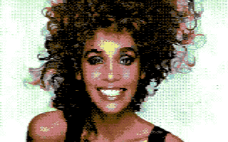

What a nice surprise, [Jaime Idolpx](https://github.com/idolpx) took off with my
[Retropixels](https://github.com/micheldebree/retropixels) code and made a better
version!

[Retropixels+](https://meatloaf.cc/tools/retropixels+/) looks better and has more functionality than my own [Web
UI](/posts/retropixels-web). And since I haven't done any work on the original for a while, I decided to archive the project on
Github.

Retropixels is a cross-platform command line tool to convert images to a format
that is supported by the legendary Commodore 64 (c-64) home computer. It can
output images in the style of the c-64, and also executables that can be run on
a real c-64.
