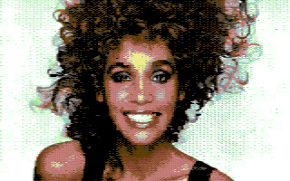

Retropixels is a cross-platform command line tool to convert images to a format
that is supported by the legendary Commodore 64 (c-64) home computer. It can
output images in the style of the c-64, and also executables that can be run on
a real c-64.

Retropixels can be found on
[Github](https://github.com/micheldebree/retropixels) and in the [npm
repository](https://www.npmjs.com/package/retropixels)

## New in this version

In this new version, you can choose between a couple of color palettes, and also
a color space to use when the image is quantized, with two new
arguments:

```sh
--palette <colodore|pepto|deekay>
--colorspace <xyz|yuv|rgb|rainbow>
```

Prior to 0.7.1, these were hardcoded to `pepto` and `yuv`. The new defaults are
`colodore` and `xyz`. I am not too sure about the science behind it, but after
playing around, I decided `colodore` combined with `xyz` looked better. What
stands out to me from the examples below is:

- More contrast and depth. Especially in faces there seems to be more
  expression.
- Colors are closer to the original and more vibrant. Also less yellowy.
- On the downside, the new setting seems to sometimes produce harsher artifacts,
  particularly black pixels that really stand out.

So, to get the best results, just play around with the settings a bit. You can
read more about the [Colodore palette](https://www.pepto.de/projects/colorvic)
and the [CIE 1931 XYZ color
space](https://en.wikipedia.org/wiki/CIE_1931_color_space) online.

<!-- markdownlint-disable MD013 -->

| Prior to 0.7.1 (hardcoded pepto/yuv)      | 0.7.1 (default colodore/xyz)                 |
| ----------------------------------------- | -------------------------------------------- |
| 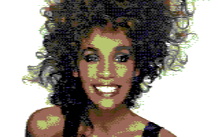         | 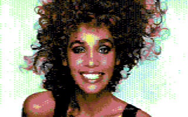         |
| 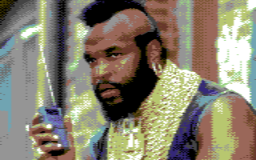                   | 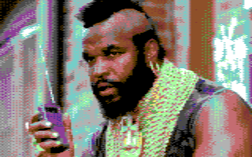                   |
| 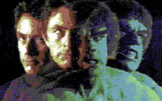               | 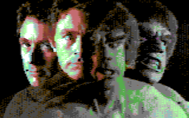               |
| 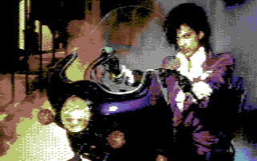           | 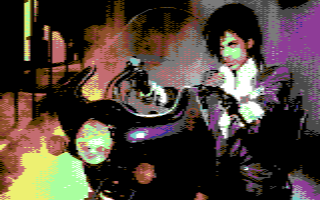           |
| 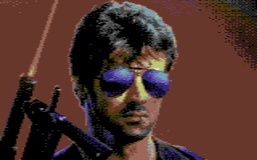             | 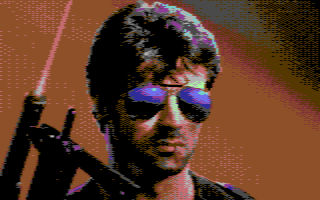             |
| 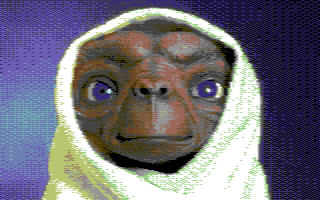                   | 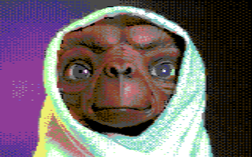                   |
| 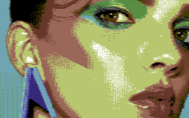    | 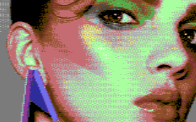    |
| 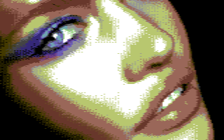 | 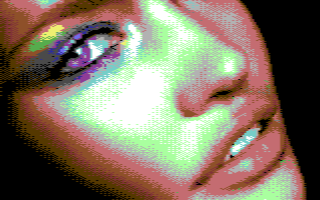 |

<!-- markdownlint-enable MD013 -->
