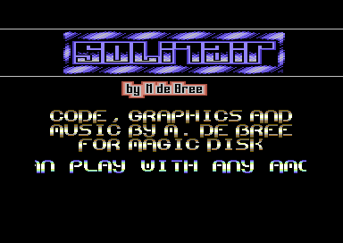
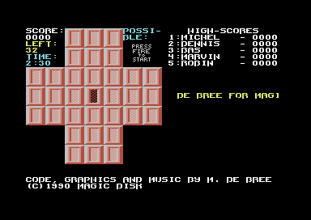
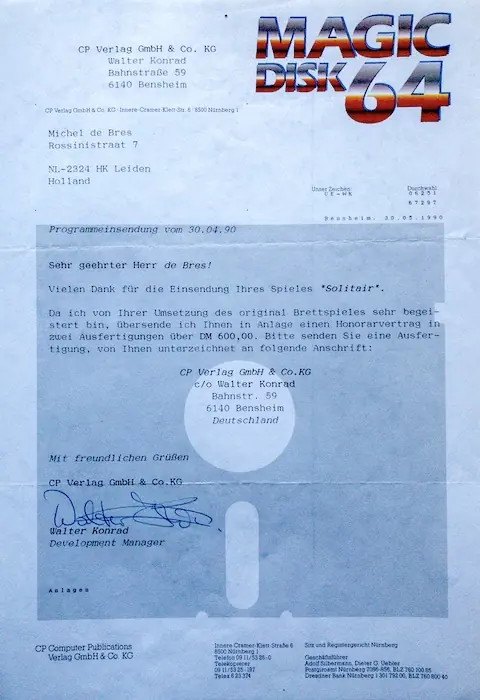
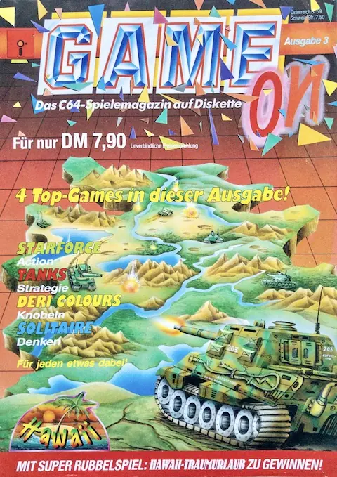

The first time I was ever payed for practising one of my biggest hobbies was in
1990, when I was 17 years old. I heard about this disk magazine called "Magic
Disk 64". This was a magazine you bought in a magazine shop, but instead of it
having physical pages, it only had a cover, a piece of cardboard and a floppy
disk inside. On the floppy disks was software that was written by amateurs and
sold to the magazine.

This sounded like a good idea to me; I liked coding but it hadn't crossed my
mind that I could have fun and make some money from it aswell. So I made a
simple game; a conversion of the board game "Solitaire", or "Solitair", as I
thought it was spelled.

I made sure I made everything myself (the code, the graphics and the music) and
sent it off, on a floppy disk, to Germany, where the magazine was from. The
hardest part was deciding on what kind of money to ask; I was afraid that if I
asked too much, that was it. So I asked 600,- deutsch mark, a bit over 600,-
dutch guilders. This is the letter I got back:

I was happy. More than 600 guilders was quite a lot of money for me, especially
for doing something I loved! A bit later, in 1991, I was able to buy the
magazine with my own game on it in the shop (in Game On, the gaming version of
Magic Disk 64):

Solitair can be found in the [Commodore Scene
Database](https://csdb.dk/release/?id=126119).
