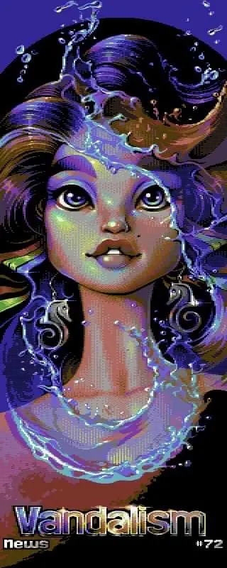

We made an exclusive background tune for the 72nd issue of the Commodore 64 disk
magazine [Vandalism News](https://csdb.dk/release/?id=216880). While you are reading
the magazine, ours is one of the tunes you can select.



The other tunes in the jukebox are by
[Laxity](https://deepsid.chordian.net/?file=/MUSICIANS/L/Laxity), [Shogoon](https://deepsid.chordian.net/?file=/MUSICIANS/S/Shogoon/), [Mutetus](https://deepsid.chordian.net/?file=/MUSICIANS/M/Mutetus), [Stinsen](https://deepsid.chordian.net/?file=/MUSICIANS/S/Stinsen),
[Magnar](https://deepsid.chordian.net/?file=/MUSICIANS/M/Magnar), [Fegolhuzz](https://deepsid.chordian.net/?file=/MUSICIANS/F/Fegolhuzz) and [Qdor](https://deepsid.chordian.net/?file=/MUSICIANS/Q/Qdor), which is an impressive line-up to be part of!

Check out the amazing opening screen aswell, by
[Mirage](https://csdb.dk/scener/?id=739):

