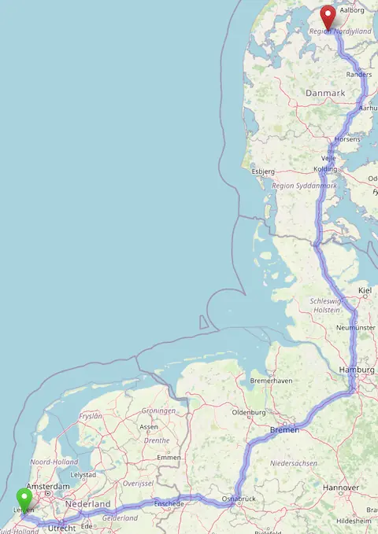
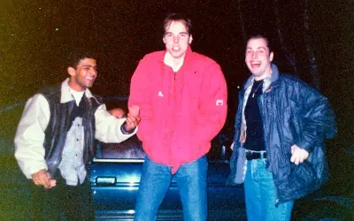
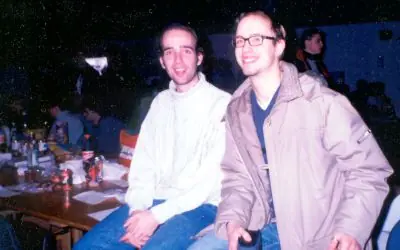
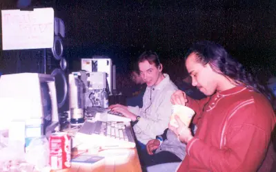
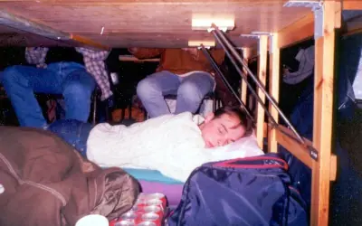

Late 1996, we got it into our minds to go visit a demoscene party in Denmark,
[The Party 6](https://demozoo.org/parties/95/). Although we had left our
Commodore 64 days behind at that time, we were still sort of forming a group
called "Heatwave", making music on Amiga and PC.

We thought it would be cool to go to a big, popular party where demosceners of
multiple platforms were present. So off we went (me, Hires, Yavin, Yanic and
Yinxs), traveling in Hires' car from Leiden in the Netherlands, to Aars in
Denmark, some 900+ kilometers.

> The trip

> Yanic, Hires and Yinxs underway up north

## The tunes

Yavin, Yanic and me made a tune for the music competitions. It was probably the
first time I made a tune that competed at a demoscene party. It was great to see
my name on the big screen and hear the music echo through the big party hall
during the competition.





We didn't end up very high in the charts. There was so much quality stuff we
didn't really make a chance, but it was a great experience to be selected and
participate! The results of all the competitions can be checked out in the
[results.txt on the "The Party"
homepage](https://demozoo.org/parties/95/results_file/174/).

## Photos

> Me with Mitch of the duo Mitch & Dane, who won the number one prize in the
> Commodore 64 music competition with [Gloria](https://demozoo.org/music/18704/)

> Yavin and Hires eating and sleeping on the job. Sleeping on the premises was
> forbidden because of safety reasons, so we had to hide under the tables to get
> some rest.
